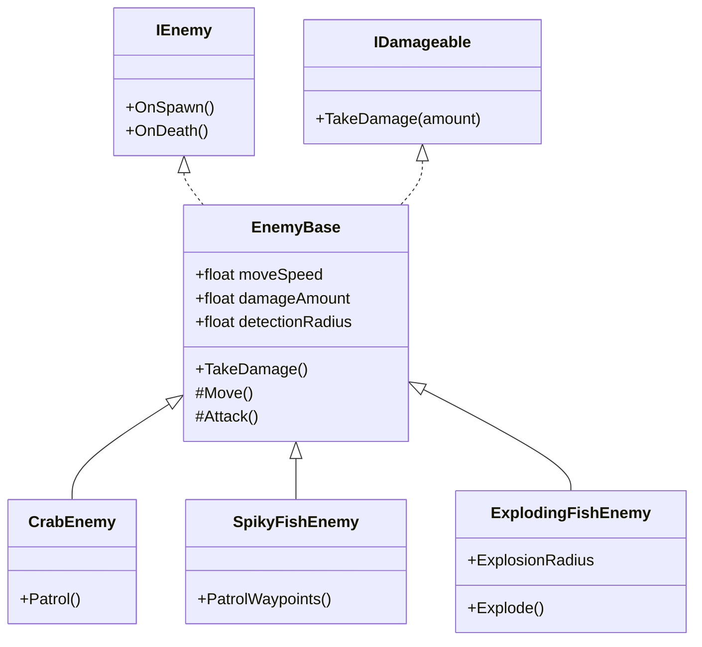

# Enemy & Hazard Framework Design

## 1. Core Concepts

This framework is designed to be **modular**, **performant**, and **DDA-ready** (Dynamic Difficulty Adjustment).

### **Key Interfaces & Base Classes**

*   **`IDamageable`**: Interface for anything that can take damage (Player, Enemies, Breakables).
*   **`IEnemy`**: Interface for all enemies to ensure they have common methods (e.g., `OnSpawn`, `OnDeath`).
*   **`EnemyBase` (MonoBehaviour)**: Base class implementing common logic:
    *   Health management.
    *   Difficulty parameter hooks (Speed, Damage).
    *   Events for Death/Hit.
*   **`HazardBase` (MonoBehaviour)**: Base class for static hazards (Spikes, Trash).

## 2. Class Architecture

## 3. Specific Implementations

### **A. Enemies**

1.  **CrabEnemy (Ground)**
    *   **Behavior**: Simple patrol between two points or random wander on the floor.
    *   **Movement**: Physics-based or simple Transform translation, respecting gravity.
    *   **DDA Hooks**: `moveSpeed`.

2.  **SpikyFishEnemy (Swimming)**
    *   **Behavior**: Patrols a set of 3D waypoints.
    *   **Interaction**: Deals damage on contact + Knockback.
    *   **DDA Hooks**: `moveSpeed`, `damageAmount`.

3.  **ExplodingFishEnemy (Swimming - Kamikaze)**
    *   **Behavior**: Idle -> Detect Player -> Chase -> Explode after delay/contact.
    *   **DDA Hooks**: `detectionRadius`, `chaseSpeed`, `explosionRadius`.

### **B. Hazards**

1.  **StickyTrashHazard**
    *   **Behavior**: Static trigger area.
    *   **Effect**: Applies a "Slow" status effect to the player while inside.
    *   **Implementation**: Uses `CalcForceField` (like WaterCurrents) but applies drag/negative velocity.

### **C. Support Creature**

1.  **SupportManta**
    *   **Behavior**: Follows a spline path (like a bus route).
    *   **Interaction**: Player can stand on it (moving platform) or hold onto it.

### **D. Checkpoint System**

1.  **CheckpointManager**
    *   Singleton.
    *   Tracks `currentCheckpoint`.
    *   Handles `RespawnPlayer()`.
2.  **Checkpoint**
    *   Simple trigger.
    *   OnEnter -> Notify Manager.

## 4. DDA Integration Strategy

A future `DifficultyManager` will be able to find all active enemies and adjust their parameters at runtime.

*   **Global Multipliers**: `EnemyBase` will have static multipliers (e.g., `EnemyBase.GlobalSpeedMultiplier`).
*   **Instance Tuning**: The Manager can iterate over `FindObjectsByType<EnemyBase>()` and tweak individual stats.

## 5. Folder Structure

*   `Assets/Scripts/Enemies/`
*   `Assets/Scripts/Hazards/`
*   `Assets/Scripts/Systems/` (CheckpointManager)
*   `Assets/Prefabs/Enemies/`
*   `Assets/Prefabs/Hazards/`
